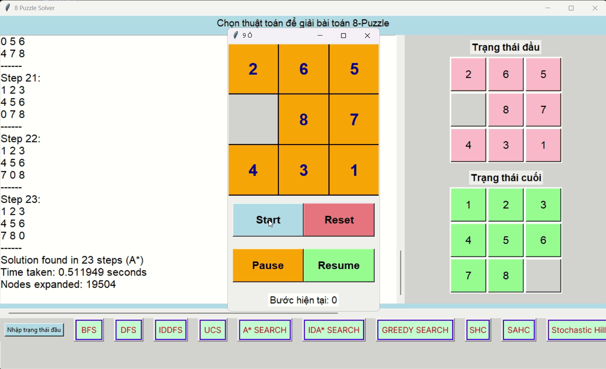
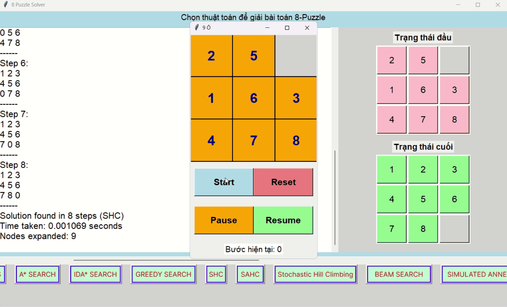

## Thuật toán tìm kiếm:

### BFS (Breadth-First Search)

### UCS (Uniform-Cost Search)

### IDDFS (Iterative Deepening DFS)

### Greedy Best-First Search

### A* Search

### IDA* (Iterative Deepening A*)

### Simple Hill Climbing (SHC)

### Steepest-Ascent Hill Climbing (SAHC)

### Stochastic Hill Climbing

### Simulated Annealing

### Beam Search 

### Generatic Algorithm

